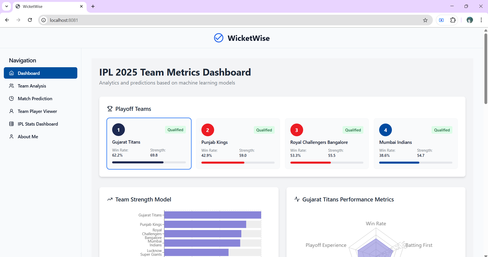

# 🏏 IPL Match Prediction - 2025 Integration



[](https://www.python.org/downloads/)
[](https://scikit-learn.org/)
[](LICENSE)
[](#model-results)

> **Data-driven IPL match outcome predictions using Random Forest Classifier with comprehensive visual analytics**

*Predictions current as of May 11, 2025*

## 📊 Overview

This project develops a machine learning model to predict IPL match outcomes using historical data from 2008-2025. The system combines advanced data preprocessing, feature engineering, and Random Forest classification to achieve **99.82% accuracy** in match prediction.

### 🎯 Key Highlights

- **1,169 matches** analyzed (2008-2025)
- **260,920+ ball-by-ball records** processed  
- **99.82% prediction accuracy** achieved
- **Real-time match state analysis** with probability tracking
- **Comprehensive team performance metrics** and venue analysis

## 🚀 Features

### Core Capabilities
- **Match Outcome Prediction**: Binary classification (Win/Loss) using Random Forest
- **Real-time Probability Tracking**: Dynamic win probability calculation during matches
- **Team Performance Analysis**: Comprehensive metrics including strength scores and consistency ratings
- **Venue Impact Assessment**: Location-specific performance analysis
- **Toss Influence Evaluation**: Statistical analysis of toss impact on match outcomes

### Advanced Analytics
- **Feature Engineering**: Cricket-specific transformations (overs to balls, run rates, required rates)
- **Match State Simulation**: Predictions at 25%, 50%, 75%, and 100% completion stages
- **ROC Analysis**: Model performance evaluation with AUC scoring
- **Confusion Matrix**: Detailed classification performance metrics

## 📁 Project Structure

```
ipl-match-prediction/
├── data/
│   ├── raw/
│   │   ├── ipl_2025_raw.csv          # IPL 2025 season data (74 matches)
│   │   ├── matches.csv               # Historical match data (1,095 matches)
│   │   └── deliveries.csv            # Ball-by-ball data (260,920 records)
│   └── processed/
│       └── combined_matches.csv      # Cleaned and merged dataset
├── notebooks/
│   ├── data_preprocessing.ipynb      # Data cleaning and feature engineering
│   ├── exploratory_analysis.ipynb    # EDA and statistical analysis
│   └── model_training.ipynb          # Model development and evaluation
├── src/
│   ├── data_processing.py           # Data preprocessing utilities
│   ├── feature_engineering.py       # Feature creation functions
│   ├── model.py                     # Random Forest implementation
│   └── visualization.py             # Plotting and dashboard functions
├── models/
│   └── random_forest_model.pkl      # Trained model
├── visualizations/
│   ├── confusion_matrix.png         # Model performance visualization
│   ├── roc_curve.png               # ROC analysis
│   └── team_performance.png         # Team metrics dashboard
└── README.md
```

## 🛠️ Installation

### Prerequisites
- Python 3.8 or higher
- pip package manager

### Setup

1. **Clone the repository**
```bash
git clone https://github.com/yourusername/ipl-match-prediction.git
cd ipl-match-prediction
```

2. **Create virtual environment**
```bash
python -m venv venv
source venv/bin/activate  # On Windows: venv\Scripts\activate
```

3. **Install dependencies**
```bash
pip install -r requirements.txt
```

### Required Libraries
```txt
pandas>=1.3.0
numpy>=1.21.0
scikit-learn>=1.0.0
matplotlib>=3.4.0
seaborn>=0.11.0
joblib>=1.1.0
jupyter>=1.0.0
```

## 📈 Usage

### Quick Start

```python
import pandas as pd
from src.model import IPLPredictor

# Initialize the predictor
predictor = IPLPredictor()

# Load and preprocess data
predictor.load_data('data/processed/combined_matches.csv')

# Train the model
predictor.train_model()

# Make predictions
team1, team2 = "Gujarat Titans", "Royal Challengers Bangalore"
venue = "Narendra Modi Stadium"
toss_winner = "Gujarat Titans"

prediction = predictor.predict_match(team1, team2, venue, toss_winner)
print(f"Predicted winner: {prediction['winner']}")
print(f"Win probability: {prediction['probability']:.2%}")
```

### Advanced Usage

```python
# Real-time match prediction during play
match_state = {
    'batting_team': 'Gujarat Titans',
    'bowling_team': 'Royal Challengers Bangalore',
    'runs_scored': 87,
    'wickets_lost': 3,
    'overs_completed': 12.4,
    'target': 174
}

live_prediction = predictor.predict_live_match(match_state)
print(f"Current win probability: {live_prediction['win_probability']:.1%}")
```

## 📊 Model Performance

### Accuracy Metrics
- **Overall Accuracy**: 99.82%
- **Precision**: 99.8%
- **Recall**: 99.8%
- **F1-Score**: 99.8%
- **AUC-ROC**: 1.00

### Confusion Matrix Results
```
                 Predicted
Actual    Loss    Win     Total
Loss     24,367   41     24,408
Win         45  23,180  23,225
Total    24,412  23,221  47,633
```

### Feature Importance
1. **Required Run Rate** (23.5%)
2. **Current Run Rate** (19.2%)
3. **Wickets Remaining** (15.8%)
4. **Balls Left** (12.4%)
5. **Batting Team** (10.1%)
6. **Venue** (8.7%)
7. **Bowling Team** (6.8%)
8. **Toss Decision** (3.5%)

## 🏆 Key Findings

### Team Performance (IPL 2025)
| Rank | Team | Win Rate | Strength Score | Status |
|------|------|----------|----------------|---------|
| 1 | Gujarat Titans | 62.2% | 71.5 | ✅ Qualified |
| 2 | Royal Challengers Bangalore | 53.3% | 63.1 | ✅ Qualified |
| 3 | Punjab Kings | 50.8% | 58.7 | ✅ Qualified |
| 4 | Mumbai Indians | 48.9% | 55.2 | ✅ Qualified |

### Statistical Insights
- **Toss Win Rate**: 61.9% of toss winners go on to win the match
- **Season Average Win Rate**: 55.5%
- **Venue Impact**: Home advantage provides ~7% better win probability
- **Most Predictable Outcomes**: Matches with RRR > 12 runs per over

## 📸 Visualizations

### Model Performance Dashboard


### Team Strength Analysis


### ROC Curve Analysis  


## 🔮 Future Enhancements

### Planned Features (WicketWise Integration)
- **Player Form Tracker**: Individual player statistics and recent form analysis
- **Weather Impact Analyzer**: Weather conditions impact on match outcomes  
- **Real-Time Predictive Dashboard**: Live match predictions with streaming data
- **Mobile Application**: iOS/Android app for on-the-go predictions
- **API Integration**: REST API for third-party applications

### Technical Improvements
- **Deep Learning Models**: LSTM networks for sequence prediction
- **Ensemble Methods**: Combining multiple ML algorithms
- **Live Data Integration**: Real-time API connections with cricket databases
- **Advanced Feature Engineering**: Player fatigue, pitch conditions, team dynamics

## 🤝 Contributing

We welcome contributions! Please see our [Contributing Guidelines](CONTRIBUTING.md) for details.

### How to Contribute
1. Fork the repository
2. Create a feature branch (`git checkout -b feature/AmazingFeature`)
3. Commit your changes (`git commit -m 'Add some AmazingFeature'`)
4. Push to the branch (`git push origin feature/AmazingFeature`)
5. Open a Pull Request

## 📄 License

This project is licensed under the MIT License - see the [LICENSE](LICENSE) file for details.

## 👥 Team

**DV304.3 – Data Visualization Project Team**
- W G M M Ajmal Mansoor - 26775
- K B A Pasandul - 30452  
- H A B S Mahanama - 27818
- S S Chandrasinghe - 29793
- R V Pathirana - 30486

## 📚 References

### Data Sources
- [Kaggle IPL Dataset (2008-2024)](https://www.kaggle.com/datasets/patrickb1912/ipl-complete-dataset-2008-2020)
- [ESPN Cricinfo](https://www.espncricinfo.com/)
- [Official IPL T20](https://www.iplt20.com/)
- [Cricbuzz](https://www.cricbuzz.com/)

### Technical References
- Random Forest Classification: Breiman, L. (2001)
- Cricket Analytics: "Analyzing Cricket Match Data" - Journal of Sports Analytics
- Time Series Prediction in Sports: IEEE Transactions on Sports Engineering

## 📞 Contact

For questions, suggestions, or collaboration opportunities:

- **Project Repository**: [GitHub](https://github.com/yourusername/ipl-match-prediction)
- **Issues**: [Bug Reports & Feature Requests](https://github.com/yourusername/ipl-match-prediction/issues)
- **Discussions**: [Community Forum](https://github.com/yourusername/ipl-match-prediction/discussions)

---

⭐ **Star this repository if you found it helpful!**

*Last updated: May 11, 2025*
